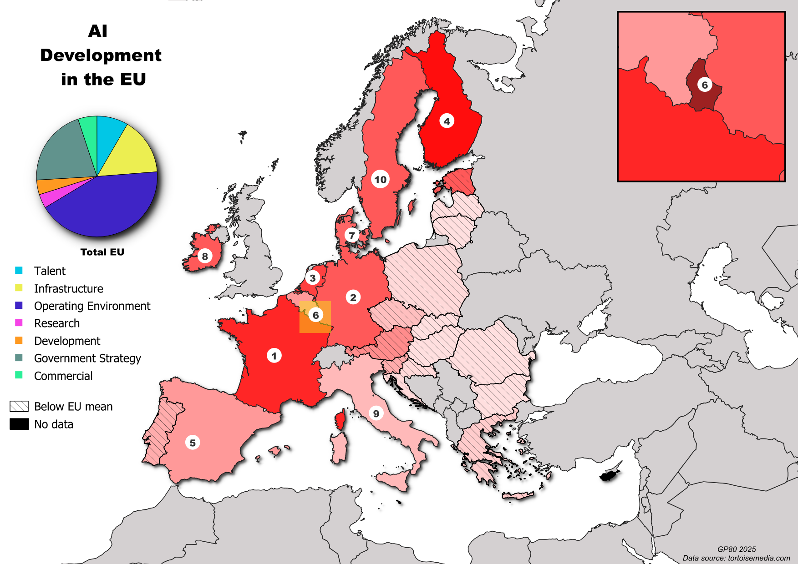

# AI Development in the EU

Choropleth map of AI development across EU countries, ranked and styled in QGIS from a publicly available AI index dataset.



## Pipeline

1. **Data wrangling** (`scripts/load_data.py`) — loads and inspects the raw AI index dataset using Pandas
2. **Geocoding** (`scripts/geocode_countries.py`) — maps country names to coordinates using geopy and Nominatim
3. **Cartography** (`qgis/eu_ai_development.qgz`) — QGIS project with graduated symbology, ranked labels, pie chart inset, and inset map for small countries

## Structure

```
├── data/               # Raw and processed CSV data
├── qgis/               # QGIS project and GeoPackage layers
├── scripts/            # Python scripts
└── output/             # Final map output
```

## Tools

- Python, Pandas, geopy
- QGIS
- Data: [Tortoise Media Global AI Index](https://www.tortoisemedia.com/intelligence/global-ai)
